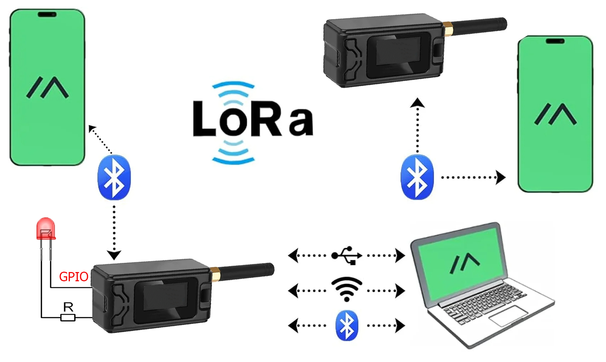

# Управление внешними устройствами через сеть Meshtastic на базе LoRa 
В базовой конфигурации meshtastic не активировано управление внешними устройствами через GPIO.
Сделать это можно несколькими способами, в статье описан один из них

<p align="center">
  <a href="photo/Meshtastic-diagram_.png">
    
  </a>
</p>

**Meshtastic** — проект для создания децентрализованной сети связи с помощью недорогих радиостанций LoRa.  
Из коробки позволяет обмениваться текстовыми сообщениями на большие расстояния, здесь мы еще научим ее управлять устройствами.

## ✨ Основные возможности Meshtastic
- 📡 Дальнобойная связь до нескольких десятков километров по радиоканалу с расширением через интернет
- 🔒 Шифрование сообщений  
- 🔋 Длительная работа от батареи  
- 💬 Отправка и приём текстов  
- 🔧 Узлы сети используют одинаковые параметры LoRa: частоту, полосу и коэффициент расширения  

## ⚙️ Как это работает
Устройства формируют **mesh-сеть**, где каждый радиомодуль ретранслирует сообщения.  
Сообщения передаются с приложения на радиомодуль через Bluetooth, Wi-Fi/Ethernet или Serial.  
Модуль хранит последние пакеты и повторяет их при необходимости, обеспечивая доставку даже самым удалённым участникам.

## 📂 Структура репозитория
```
├── meshtastic-gpio/
├── README.md         # Основное описание проекта
├── docs/             # Документация и вспомогательные материалы
│ └── photos/         # Скриншоты, примеры фото/кадров
│
├── scripts/          # Основные рабочие скрипты
│ ├── timelaps.sh     # Съёмка кадров, watermark, запись маркеров
│ ├── color_detect.sh # Детекция полярного сияния по цветам
│
├── LICENSE           # Лицензия проекта (например, MIT)
└── .gitignore        # Исключения для Git (логи, секреты, временные файлы)
```

<p align="center">
  <a href="photo/demo2.gif">
    
  </a>
</p>

## ⚖️ Лицензия
Проект распространяется под лицензией [MIT](LICENSE).

