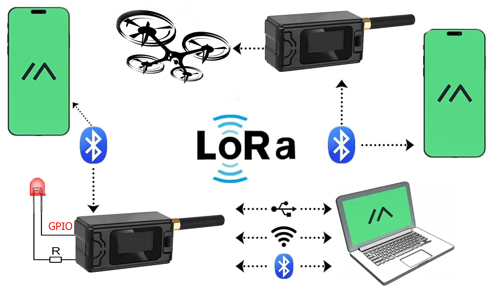
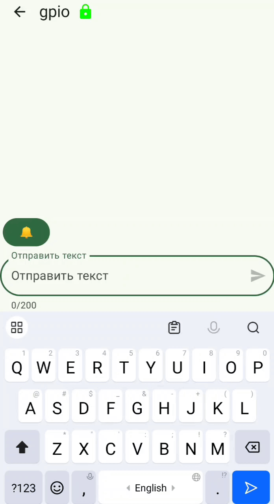
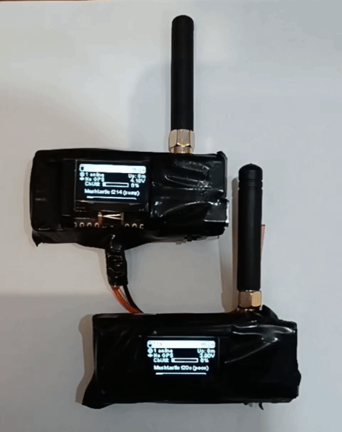
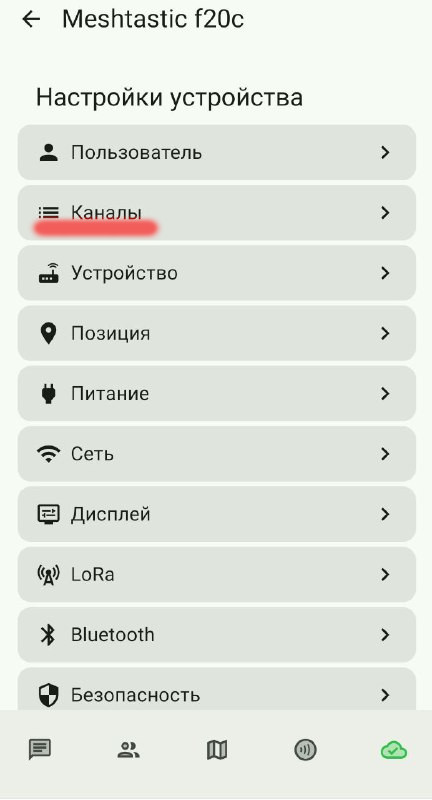
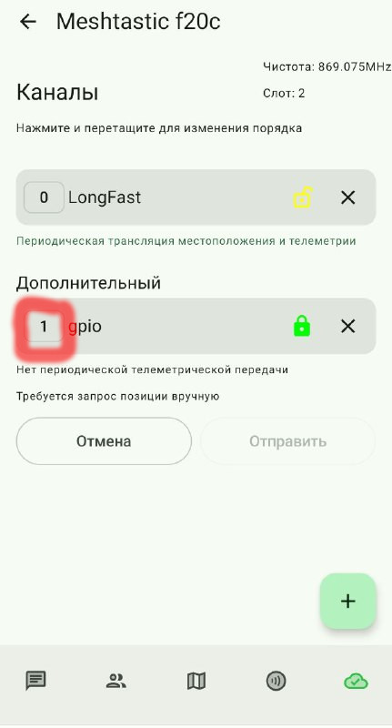

# Управление внешними устройствами через сеть Meshtastic на базе LoRa 
В базовой конфигурации meshtastic не активировано управление внешними устройствами через GPIO.  
Управлять можно включением различных устройств от светодиода до квадрокоптера.  
Сделать это можно несколькими способами,а в статье описан один из них, нащупанный самостоятельтно, хотя на оригинальность автор, конечно, не претендует. 

<p align="center">
  <a href="photo/Meshtastic-diagram3.png">
    
  </a>
</p>

**Meshtastic** — проект для создания децентрализованной сети связи с помощью недорогих радиостанций LoRa.  
Из коробки позволяет обмениваться текстовыми сообщениями на большие расстояния, здесь мы еще научим ее еще управлять внешними устройствами.

## Пример работы
 На изображении устройство по сообщению "on" включает светодиод, по "off" выключает


<p align="center">
  <a href="photo/demo5.gif">
    
  </a>
  &nbsp;&nbsp;&nbsp;
  <a href="photo/demo3.gif">
    
  </a>
  &nbsp;&nbsp;&nbsp;
   <a href="photo/demo2.gif">
    
  </a> 
</p>


<br/>
<br/>

## ✨ Основные возможности Meshtastic
- 📡 Дальнобойная связь до нескольких десятков километров по радиоканалу с расширением через интернет
- 🔒 Шифрование сообщений  
- 🔋 Длительная работа от батареи  
- 💬 Отправка и приём текстов  
- 🔧 Узлы сети используют одинаковые параметры LoRa: частоту, полосу и коэффициент расширения  

Устройства формируют **mesh-сеть**, где каждый радиомодуль ретранслирует сообщения.  
Сообщения передаются с приложения на радиомодуль через Bluetooth, Wi-Fi/Ethernet или Serial.  


## 📂 Структура репозитория
```
├── meshtastic-gpio/
├── README.md         # Основное описание проекта
├── docs/             # Документация и вспомогательные материалы
│ └── photos/         # Скриншоты, примеры фото/кадров
│
├── src/          # Основные  скрипты
│ ├── ExternalNotificationModule.cpp     # Готовый модуль для работы с GPIO
│
├── LICENSE           # Лицензия проекта (например, MIT)
└── .gitignore        # Исключения для Git (логи, секреты, временные файлы)
```
 

## ⚡ Поэтапная настройка Meshtastic на LilyGO T3-S3 (ESP32-S3)

### Начнем с установки необходимых компонентов

- Установка Python и pip
```bash
sudo pacman -S python python-pip
```

- Установка Meshtastic CLI (утилита для работы с устройством)
```bash
pip install --upgrade meshtastic
```

- Установка esptool (для стирания/прошивки флеша)
```bash
pip install esptool
```

 - Установка платформио (для записи прошивки на устройство)
```bash
pipx install platformio
```
Проверка правильности установки
```bash
platformio --version
```
###  Переходим к работе с устройством 
📥Клонируем репозиторий Meshtastic
```bash
git clone https://github.com/meshtastic/firmware.git
```
Эта команда скачает (клонирует) репозиторий с GitHub в текущий каталог, из которого мы её запускаем.  
Пример: /home/mrbeast/firmware/  
По умолчанию команда git clone внутри текущего каталога создаст новую папку с именем репозитория — firmware.
В неё скопируется весь код, история коммитов и служебные файлы Git.  
Можно заглянуть в этот каталог и посмотреть что скачалось
```bash
cd firmware
ls -l
```

#### 🔌 Подключение LilyGO T3-S3 (ESP32-S3) и прошивка.
Теперь нам необходимо перевести чип в режим загрузчика (bootloader mode), иначе esptool или platformio не смогут начать запись во flash.  
Делается это нажатием комбинации кнопок на устройстве следующим образом:  
Зажать кнопку boot и не отпуская ее, нажать один раз reset, затем отпустить boot.  
На данном этапе режим загрузчика нам нужен, чтобы сделать полное стирание памяти через утилиту esptool и прошить устройство.


🔍 Определим на каком порту определилось устройство
```bash
ls /dev/tty*
```
В списке появится новое устройство — обычно это /dev/ttyACM0 или похожее имя.  
Чтобы точно понять, какой именно порт используется, можно сначала выполнить команду без платы, 
а затем повторить с подключенной — появившаяся строка и будет нужным портом.  
Можно проверить подключение платы к Meshtastic
```bash
meshtastic --port /dev/ttyACM0 --info
```

Далее производим стирание памяти, указывая порт, полученный на предыдущем шаге
```bash
esptool.py --chip esp32s3 --port /dev/ttyACM0 erase_flash
```
####  Включение модуля RemoteHardware
Нам нужна возможность управлять пинами платы (GPIO) дистанционно,  
тоесть нужно включить модуль RemoteHardware в сборку,  
а для этого открываем  в блокноте или проводнике файл platformio.ini.  
и удалям строку DMESHTASTIC_EXCLUDE_REMOTEHARDWARE=1  
Удаление строки включает модуль RemoteHardware

#### 🛠️ Сборка прошивки для работы с GPIO

Переходим в папку, куда скачали прошивку
```bash
cd /home/mrbeast/firmware/
```
Собираем прошивку
```bash
platformio run -e tlora-t3s3-v1
```
Прошиваем плату
```bash
platformio run -e tlora-t3s3-v1 -t upload --upload-port /dev/ttyACM0
```


#### Далее несколько конфигураций с нарастающим функционалом.

1️⃣ Эта конфигурация зажигает подключенный светодиод от каждого сообщения в любом канале.
```bash
meshtastic --set external_notification.enabled true \  # включает модуль RemoteHardware для управления GPIO и внешними устройствами
  --set external_notification.alert_message true \     # реагировать на входящие сообщения
  --set external_notification.output 42 \              # назначает GPIO42 для светодиода
  --set external_notification.active true \            # лог. "1" включает светодиод
  --set external_notification.output_ms 1000           # длительность сигнала — 1 секунда
```

      
2️⃣ Если хотим чтоб реагировал не на все сообщения, а на определенный канал,  
то ищем файл ExternalNotificationModule.cpp,  
который находится в каталоге /home/mrbeast/firmware/src/modules/  
В нем ищем строку if (!isFromUs(&mp))  
и заменяем ее на if (!isFromUs(&mp) && mp.channel == 1),  
где единичка это номер нашего канала который мы впоследствии создадим (именно номера, а не названия канала, его можно посмотреть в приложении).  
<p align="center">
  <a href="photo/chenal2.jpg">
    
  </a>
  <a href="photo/chenal1.jpg">
    
  </a>
</p>

Также можно вставить и уникальный идендификато канала, так как первым по порядку может оказаться другой канал.
Далее опять пересобираем платформио:
```bash
platformio run -e tlora-t3s3-v1
```

Перепрошиваем устройство:
```bash
platformio run -e tlora-t3s3-v1 -t upload --upload-port /dev/ttyACM0
```
Создаем отдельный канал, который называем например GPIO, в нем будем пересылать сообщения для управления внешними устройствами:
```bash
meshtastic --ch-add gpio
```
Канал можно создавать и в приложении,поэтому шаг не обязательный
Впоследствии при синхронизации устройств этот канал появится и на другом устройстве, я это делал через qr код в приложении. 
Обращаем внимание чтобы номер канала был 1, это можно посмотреть в приложении.
Сопрягаем устройства
и применяем блок команд с предыдущего раздела.
```bash
meshtastic --set external_notification.enabled true \
  --set external_notification.alert_message true \
  --set external_notification.output 42 \
  --set external_notification.active true \
  --set external_notification.output_ms 1000
```
В этом примере светодиод также загорается на 1 секунду от каждого сообщения в канале №1, а потом гаснет.

3️⃣ Следующим шагом может быть то, что светодиод загорается по сообщению On, а ганет по сообщени Off.
Для этого необходимо заменить кусок кода все в том же файле ExternalNotificationModule.cpp, 
который находится в каталоге /home/mrbeast/firmware/src/modules/
```bash
        if (!isFromUs(&mp) && mp.channel == 1) {
 
    // Check if the message contains a bell character. Don't do this loop for every pin, just once.
    auto &p = mp.decoded;
    std::string msgText(reinterpret_cast<const char*>(p.payload.bytes), p.payload.size);
    if (msgText == "On") {
    LOG_INFO("Received 'On' message — turning LED ON (constant)");
    isNagging = false;  // <-- отключаем режим мигания
    setExternalState(0, true);
    nagCycleCutoff = UINT32_MAX; // просто на всякий
    return ProcessMessage::CONTINUE;
} else if (msgText == "Off") {
    LOG_INFO("Received 'Off' message — turning LED OFF");
    isNagging = false;
    setExternalState(0, false);
    nagCycleCutoff = 1;
    return ProcessMessage::CONTINUE;
} else {
    // Любое другое сообщение — игнорировать
    LOG_INFO("Message ignored: %s", msgText.c_str());
    return ProcessMessage::CONTINUE;
}
```

Далее действия повторяются с предущих конфигурациях, опять пересобираем платформио
```bash
platformio run -e tlora-t3s3-v1
```
Перепрошиваем устройство
```bash
platformio run -e tlora-t3s3-v1 -t upload --upload-port /dev/ttyACM0
```
Заново создаем канал gpio например, смотрим в приложении, чтобы его номер был 1, сопрягаем устройства
Применяем блок команд, такой же как и в предыдущих примерах, кроме зажигания на 1 секунду, так как он переключается теперь по команде:
```bash
meshtastic --set external_notification.enabled true \
  --set external_notification.alert_message true \
  --set external_notification.output 42 \
  --set external_notification.active true
```

## Почему в  Meshtastic отключена поддержка управления GPIO.  
Это сделано специально: чтобы ядро  было максимально стабильным, а побочный функционал остался на уровне кастомизации. Meshtastic создавался для передачи сообщений и датчиковых данных в условиях отсутствия интернета.в тоже время Meshtastic задумывался как гибкая платформа: если хочется GPIO-контроля, разработчики оставили возможность допилить самим или собирать кастомный бинарь.

##  Справочно: 
Почему в  Meshtastic отключена поддержка управления GPIO? Это сделано специально: чтобы ядро  было максимально стабильным, а побочный функционал остался на уровне кастомизации. Не обошлось и без заботы о безопасности,что бы исключить возможность неопытному пользователю подключения нагрузки без должной защиты. Meshtastic создавался для передачи сообщений и в условиях отсутствия интернета.В тоже время Meshtastic задумывался как гибкая платформа: если хочется GPIO-контроля, разработчики оставили возможность доработатькодс самостоятельно. 

## ⚖️ Лицензия
Проект распространяется под лицензией [MIT](LICENSE).

